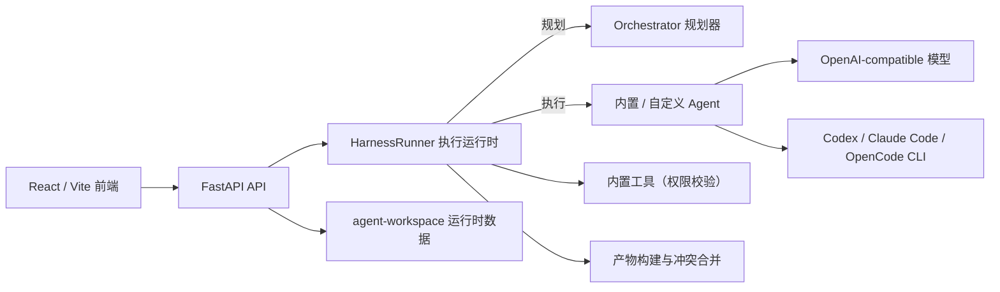

# AgentHub

AgentHub 是一个基于 FastAPI 与 React 的 Web 多 Agent 协作工作台。用户可以在统一聊天界面中调用多个 Agent、工具和外部 CLI，管理上下文，并查看代码、网页预览、Diff、文档和部署等产物。

> 项目当前处于 Alpha 阶段，适合本地开发、功能验证和二次开发。

## 主要功能

- 单 Agent 与多 Agent 群聊
- Orchestrator 任务拆解、路由、并行执行与结果汇总
- 内置代码、UI、审查、视觉和文件分析 Agent
- 自定义 Agent 的创建、编辑、删除与模型配置
- OpenAI-compatible 模型接入
- Codex CLI、Claude Code、OpenCode 进程适配
- 文件和图片上传、上下文固定、长上下文摘要
- 代码、网页预览、Diff、冲突、工作流和部署产物
- Diff 应用、分块确认、回滚与产物版本恢复

## 技术架构



职责划分：`orchestration` 负责规划（把一条消息拆成带依赖关系的 PlanStep），
`harness` 负责执行（调度并行步骤、调用适配器、工具权限校验、运行限额、
失败降级和产物聚合）。模型调用对 429/5xx/超时做指数退避重试，
不可重试错误（401/400 等）快速失败。

## 目录结构

```text
app/
  api/                  FastAPI 路由与服务
  configs/              Agent、模型和工具配置
  web/                  React / Vite 前端
src/agenthub/
  adapters/             模型与外部 CLI 适配器
  artifacts/            产物构建、冲突处理与版本
  domain/               Agent/Artifact/Plan 等领域模型
  harness/              执行运行时（runner、权限、限额、降级）
  orchestration/        任务规划（规则 + LLM Planner）
  policies/             Agent/Tool/Run 策略
  tools/                内置工具
skills/                 Agent 技能提示词
tests/                  后端自动化测试
```

`agent-workspace/` 会在运行时自动创建，用于保存会话、上传文件、预览和部署产物。该目录已被 Git 忽略，不属于源码。

## 环境要求

- Python 3.11+
- Conda
- [uv](https://docs.astral.sh/uv/)
- Node.js 18+
- npm

## 安装

```powershell
conda activate agenthub
uv sync --group dev

cd app\web
npm install
cd ..\..
```

## 环境变量

复制环境变量模板：

```powershell
Copy-Item .env.example .env
```

默认配置使用 Mock Agent，不需要 API Key。使用真实模型时，在 `.env` 中设置对应供应商的 `API_KEY`、`BASE_URL` 和模型名称，并设置：

```env
ENABLE_REAL_LLM=true
DEFAULT_MODEL_PROVIDER=stepfun
```

模型列表位于 `app/configs/models.yaml`，Agent 定义位于 `app/configs/agents.yaml`。

### 外部 CLI

如需接入本机 CLI，请先安装并完成登录，再在 `.env` 中配置命令：

```env
CODEX_MODE=cli
CODEX_COMMAND=codex
CLAUDE_CODE_COMMAND=claude
OPENCODE_COMMAND=opencode
```

## 启动

后端：

```powershell
conda activate agenthub
python -m uvicorn app.api.main:app --reload --host 0.0.0.0 --port 8000
```

前端：

```powershell
cd app\web
npm run dev -- --host 0.0.0.0 --port 5173
```

- Web 界面：<http://127.0.0.1:5173>
- API 文档：<http://127.0.0.1:8000/docs>

## 测试

```powershell
conda activate agenthub
python -m pytest -q

cd app\web
npm run build
```

## 安全与开源检查

- `.env`、`.env.*` 和 `agent-workspace/` 已加入 `.gitignore`。
- `.env.example` 只能放空值或公开配置，禁止填写真实密钥。
- 提交前使用 `git status` 和 `git diff --cached` 检查待提交内容。
- 如果密钥曾进入 Git 历史，仅删除文件或加入 `.gitignore` 不够；必须轮换密钥，并在公开仓库前清理 Git 历史。

## 当前限制

- 外部 CLI 的可用性取决于本机安装、登录状态和命令输出格式。
- 网页预览面向受控开发内容，不应直接运行不可信代码。
- 本地部署仅提供静态预览，不等同于生产环境发布。
